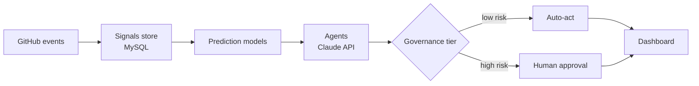

# Architecture

PragMattie Sync is a monorepo with two parts:

1. **The product:** PragMattie Sync CRM (`apps/api` FastAPI + MySQL, `apps/web` Vue 3 + Vuetify).
2. **The orchestration layer:** (`orchestrator/`) predicts delivery risk and delay, and runs AI agents that act on those predictions under risk-based governance tiers.

See the full blueprint for the agent roster, models, tiers and phased plan.
